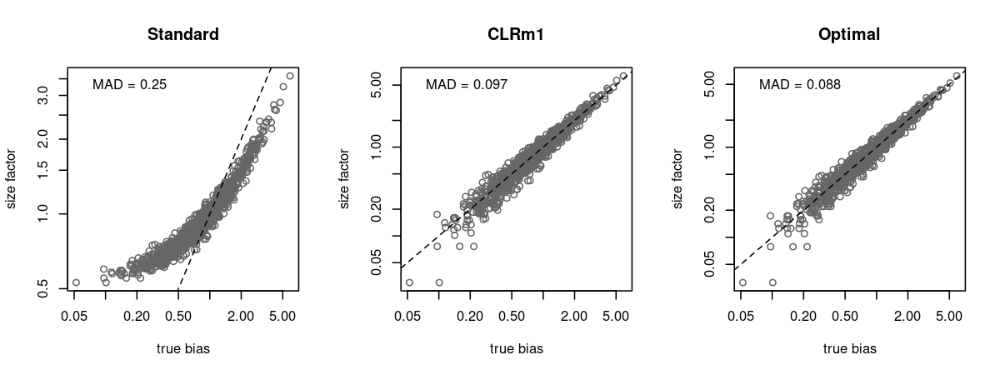
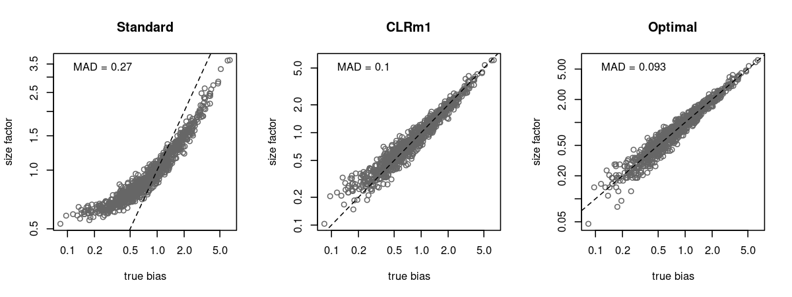
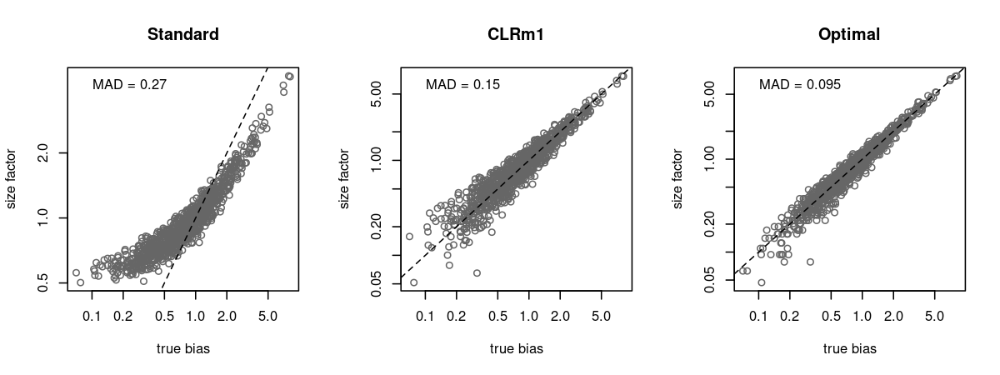
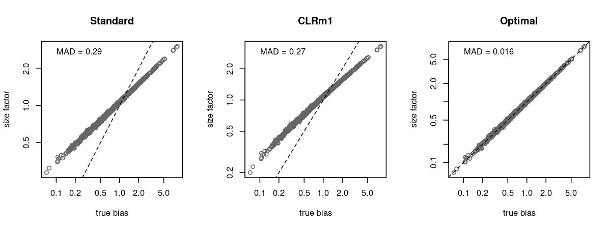
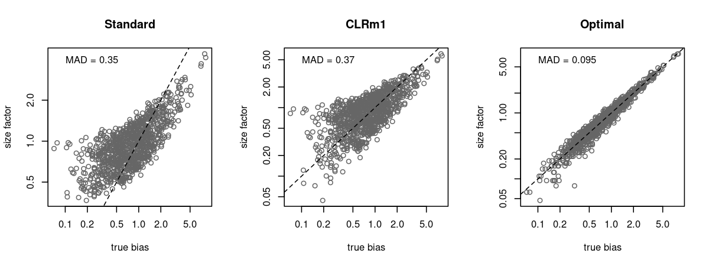

# Normalization of ADT data

## Background

Most workflows for scaling normalization of ADT data use the geometric mean as the size factor, based on the CLR method used by Stoeckius et al. (2017).
This is a simple and pragmatic solution to the problem of composition biases introduced by a minority of high-abundance tags.

Consider a cell $i$ with $n$ tags where the count for tag $t$ is $`y_{it}`$.
Assume we have another cell $j$ with the same counts as $i$ except for one tag $t'$, where $`y_{jt'} = by_{it'}`$ for $b \gg 1$.
If we use the total count as the size factor for each cell (i.e., $`\sum_t y_{it}`$),
the ratio of the size factors between $i$ and $j$ is a linear function of $b$;
this represents the composition bias introduced by the differential abundance of $l$.
For comparison purposes, let's consider the case where all $`y_{it}`$ are equal, such that the composition bias simplifies to $`1 + (b-1)n^{-1}`$.
If we use the geometric mean (i.e., $`\sqrt[n]{\prod_t y_{it}}`$), the composition bias is instead $\sqrt[n]{b}$,
which is always smaller than $`1 + (b-1)n^{-1}`$ when $b > 1$.

An obvious issue with the geometric mean is that it is equal to zero when one or more values are zero.
As such, we usually add a pseudo-count - typically 1 - to ensure that some information is preserved from the non-zero counts.
(Alternatively, I suppose we could directly replace zeros with a value of 1, though this is rarely done as it discards the distinction between 0 and 1 in the original data.)
This workaround introduces its own bias in the form of a fold-change from the expected value of the tag with the zero count and its pseudo-count-based replacement,
effectively overestimating the size factor. 

## Improving performance at low counts

The "standard" CLR formula for the size factor for cell $i$ is $`\sqrt[n]{\prod_t (y_{it} + 1)}`$.
This is typically implemented as $`f(z_i) = \exp(z_i)`$ where $`z_i`$ is the mean of $`g(y_{it}) = \log(y_{it} + 1)`$,
as used by [**Seurat**](https://github.com/satijalab/seurat/blob/1549dcb3075eaeac01c925c4b4bb73c73450fc50/R/preprocessing5.R#L345)
and [**muon**](https://github.com/scverse/muon/blob/94917d23291f329a19b3c282276c960d414319ad/muon/_prot/preproc.py#L229).
However, attentive readers will notice that the addition of a pseudo-count means that $f()$ is not the inverse of $g()$.
Perhaps we should consider defining $`f(z_i) = \exp(z_i) - 1`$ for the sake of symmetry.
Our modified size factor would then be defined as $`\sqrt[n]{\prod_t (y_{it} + 1)} - 1`$, which we call the "CLRm1" size factor.

Despite its rather _ad hoc_ derivation, the CLRm1 approach works surprisingly well.
In a simulation with all-background counts, the CLRm1 size factors accurately reflect the true biases,
with deviation comparable to the optimal estimate (i.e., the sum of Poisson-distributed counts).

Let's randomly choose a single tag for each cell and increase its abundance 100-fold to introduce some composition biases.
CLRm1's performance advantage over the standard approach is still present:

We add even more composition biases by randomly choosing 0, 1 or 2 tags for each cell and increasing their abundance 100-fold.
We continue to see an improvement for CLRm1 over the standard method, albeit reduced:

## Rationalizing the performance

Let us consider two cells $k$ and $k'$ that only differ in their counts by some scaling factor $a$. 
The ideal normalization method would produce a size factor for $k'$ that is $a$-fold larger than that of $k$,
thus eliminating the scaling difference between the two cells.

- In the case where $`y_{kt}`$ is equal to some constant $`c_k`$ for all $t$, the CLRm1 size factor simplifies to $`(c_k + 1) - 1`$ for $k$ and $`(ac_k + 1) - 1`$ for $k'$.
  The ratio in the size factors will be equal to $a$.
- A generalization of the previous point involves approximating the geometric mean with the arithmetic mean.
  This approximation is satisfactory if the variance in $`y_{kt}`$ is low relative to the mean (see Equation 31 and related discussion in Rodin, 2014).
  Doing so simplifies the CLRm1 factor to $`n^{-1}\sum_t(y_{kt} + 1) - 1`$ for cell $k$ and $`n^{-1}\sum_t(ay_{kt} + 1) - 1`$ for cell $k'$, again yielding a ratio of $a$.
- If all $`y_{kt}`$ and $`ay_{kt}`$ are much greater than 1, the addition or subtraction of the pseudo-count can be ignored entirely.
  The size factors for the two cells cancel out, leaving us with $a$.
- In the rare case that all $`y_{kt}`$ are much less than 1, we can approximate $`\prod_t (1 + y_{kt}) \approx 1 + \sum_t y_{kt}`$.
  We can further approximate $`\sqrt[n]{1 + z} \approx 1 + zn^{-1}`$ when $z$ is close to zero.
  This allows us to obtain a size factor of $`(1 + n^{-1}\sum_t y_{kt}) - 1`$ for $k$ and $`(1 + an^{-1}\sum_t y_{kt}) - 1`$ for $k'$,
  which again cancels out to $a$.

This analysis suggests that our approach will deteriorate when $`y_{kt}`$ is highly variable with at least one small/zero value.
Indeed, we see poor performance for a simulation with highly variable background counts:

Our hope is that this does not happen too frequently in real data, as there should not be large fluctuations in the ambient concentrations of different tags.
At the very least, users can eliminate unnecessary variability by removing uninformative all-zero rows from the count matrix before using CLRm1.
Perhaps even more protection could be gained by trimming away the tags with the most extreme average abundances across all cells,
though this must be weighed against the loss of precision of the size factor estimates when the number of tags is decreased.

Of course, differentially abundant tags will also introduce variation in $`y_{kt}`$.
Both the standard method and CLRm1 perform poorly in a simulation with many (up to 10) differentially abundant tags:

This result is not surprising as some loss of accuracy is to be expected from composition bias.
Indeed, it demonstrates a fundamental weakness of geometric mean-based methods - 
the composition bias is only mitigated without any attempt to explicitly ignore or remove it à la robust ratio-based methods like **DESeq** normalization or **edgeR**'s TMM.
Unfortunately, the latter are unreliable on sparse data, and the workarounds to reduce sparsity are tedious, e.g., pre-clustering or deconvolution (Lun et al., 2015).

CLRm1 is appealing as it can be easily calculated with good performance in the presence of minor composition biases.
For datasets with strong composition biases... well, at least CLRm1 isn't any worse than the standard method.

## Implementations

The CLRm1 procedure itself is so simple that it is barely worth providing a reference implementation.
Nonetheless, we provide some code for easy vendoring into other applications:

- [Base R](https://github.com/libscran/clrm1/blob/master/package/R/clrm1.R).
- [R with `DelayedArray` objects](https://github.com/libscran/clrm1/blob/master/package/R/clrm1.R) to avoid copies.
- [C++](https://github.com/libscran/clrm1/blob/master/package/src/clrm1.hpp) using [**tatami**](https://github.com/tatami-inc/tatami).

## References

Stoeckius M, Hafemeister C, Stephenson W, et al. (2017).
Simultaneous epitope and transcriptome measurement in single cells.
_Nature Methods_ 14, 865-868.

Rodin B (2014).
Variance and the Inequality of Arithmetic and Geometric Means.
_arXiv_ doi:10.48550/arXiv.1409.0162.

Lun ATL, Bach K, Marioni JC (2016).
Pooling across cells to normalize single-cell RNA sequencing data with many zero counts.
_Genome Biology_ 17, 75.
